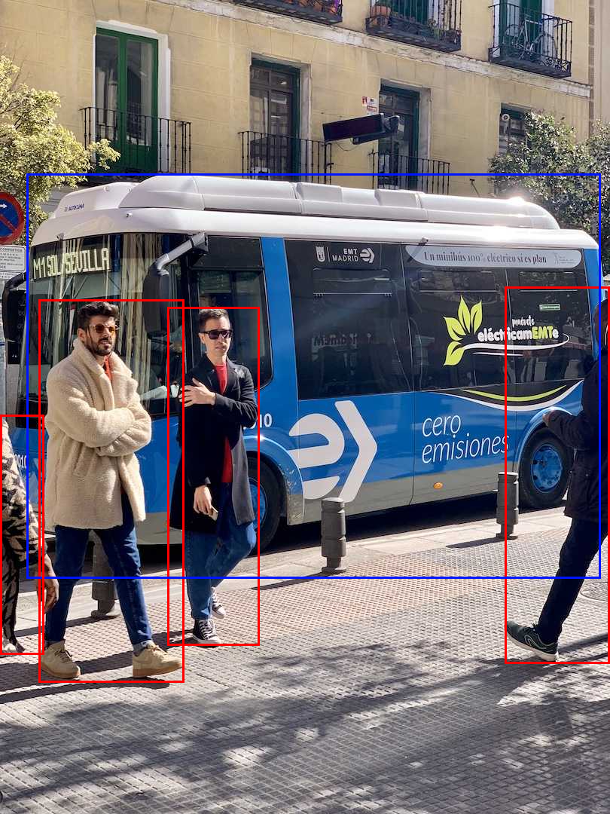
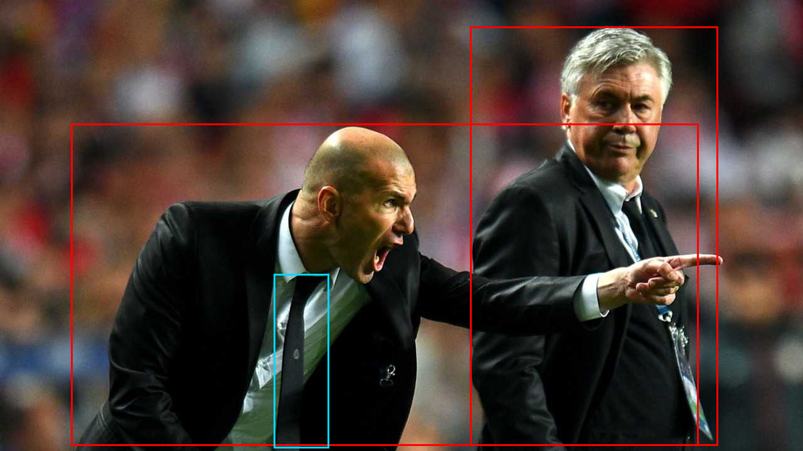

# yolov8_cpp

Training **YOLOv8** in C++ — first with LibTorch, then with **zero external
dependencies** (a from-scratch autograd engine, C++ standard library only).

日本語: 本物の YOLOv8 を C++ で学習する実験。まず LibTorch で損失の順伝播・逆伝播が
本家と一致することを確かめ、実物の yolov8n を C++ から学習。さらに **依存ライブラリを
完全に外して**、自作 autograd エンジン（標準ライブラリのみ）で yolov8n の順伝播・損失・
学習を再現する。CPU / OpenMP は `-fopenmp` の有無だけで切り替え。

Every step is **verified numerically against PyTorch / Ultralytics** (bit-level on
forward, ~1e-8 on gradients).

**→ [PORTING_GUIDE.md](PORTING_GUIDE.md): how to port a Python YOLO's training to C++**
(the methodology, gotchas, and how to adapt it to yolov5 / yolov11).
**→ [ROADMAP.md](ROADMAP.md): planned work**.

## Demo — real-image detection, no Python, no libraries

Weights ship in the repo (`weights/yolov8n/`, packed fused conv weights) plus the
original `yolov8n.pt`, so the pure detector runs straight from a checkout with only a
C++ compiler and the two vendored single-header image libs:

```sh
g++ -std=c++20 -O2 -Ipure/third_party pure/m6_demo.cpp -o m6_demo    # or: cl /std:c++20 /O2 /EHsc /Ipure\third_party pure\m6_demo.cpp
./m6_demo assets/bus.jpg    bus_out.png    640
./m6_demo assets/zidane.jpg zidane_out.png 640
```

| `assets/bus.jpg` → | `assets/zidane.jpg` → |
|---|---|
|  |  |

```
assets/bus.jpg  810x1080         assets/zidane.jpg  1280x720
  person conf=0.89               person conf=0.83
  person conf=0.88               person conf=0.83
  person conf=0.88               tie    conf=0.29
  bus    conf=0.84
  person conf=0.44
```

These match Ultralytics' own yolov8n output (boxes to ~8e-5 on the letterboxed input,
same classes — see `pure/m6_infer.cpp`). The decode + NMS are in `pure/infer.hpp`.

## Two tracks

### 1. LibTorch track — port the v8 loss, then train the real yolov8n
The hard, non-obvious parts of `v8DetectionLoss` are hand-ported to C++ and checked
against Ultralytics; LibTorch's autograd handles the backward pass.

| file | what it verifies | result |
|------|------------------|--------|
| `step1_dfl_ciou.cpp` | DFL decode + CIoU | bit-identical |
| `step2_tal.cpp` | TaskAlignedAssigner (full) | bit-identical |
| `step3a/b/c` | DFL loss / 3-loss forward / **backward grads** | ~1e-8 |
| `step4_train.cpp` | tiny CNN training loop | loss ↓ |
| `step5_train_yolov8n.cpp` | **load real yolov8n (TorchScript) and train** | loss 13.8 → 0.9 |

`v8loss.h` is the reusable loss module. `ref/*.py` generate the references.

### 2. Pure track (`pure/`) — no LibTorch, no CMake, just `g++`
A minimal reverse-mode autograd engine over dense tensors, then all of yolov8n on top.

| file | milestone | result |
|------|-----------|--------|
| `pure/autograd.hpp` | engine core + spatial ops (conv/pool/upsample/concat) | gradcheck OK |
| `pure/gradcheck*.cpp` | finite-difference gradient checks | max err ~1e-4 |
| `pure/net.hpp` + `pure/m3c_forward.cpp` | **full yolov8n forward** | matches real net ~3e-5 |
| `pure/v8pure.hpp` + `pure/m4bc_loss.cpp` | v8 loss forward + **backward** | grads match torch ~1e-9 |
| `pure/m5_train.cpp` | **end-to-end training** (forward→TAL→loss→backward→SGD) | loss 12.6 → 6.2 |
| `pure/infer.hpp` + `pure/m6_infer.cpp` | **inference: DFL decode + NMS** | dets match ultralytics ~8e-5 |
| `pure/m6_demo.cpp` | **real-image inference** (stb_image → letterbox → detect → annotate) | bus + 4 people |
| `pure/bn.hpp` + `pure/m7_bn.cpp` | **BatchNorm2d as a trainable op** (fwd/bwd + running stats) | match torch ~1e-7 |
| `pure/net_unfused.hpp` + `pure/m8_forward_unfused.cpp` | full forward with conv+BN+SiLU **unfused** | matches net ~2e-5 |
| `pure/m9_train_writeback.cpp` | **train (live BN) → write weights back to `.pt`** | serialization exact; Ultralytics runs it |
| `pure/optim.hpp` + `pure/m10_optim.cpp` | **optimizers** (SGD/mom/WD/Nesterov, Adam, AdamW) | match torch.optim ~1e-7 |
| `pure/linalg.hpp` + `pure/m11_matmul.cpp` | **matmul + transpose** (for v11 attention) | match torch ~1e-7 |
| `pure/net_dyn.hpp` + `pure/m12_dyn.cpp` | **data-driven net** (arch manifest, any size) | n / s / m match ~1e-4 |
| `pure/onnx.hpp` + `pure/onnx_export.cpp` | **ONNX writer** (hand-rolled protobuf, no deps) | onnxruntime runs it, ~2e-5 |
| `pure/onnx_run.hpp` + `pure/m13_onnx_run.cpp` | **ONNX reader + graph interpreter** | pure engine runs the `.onnx`, ~2e-5 |
| `pure/dataset.hpp` + `pure/m14_train_real.cpp` | **real-data training** (batched: stb images + labels → TAL → loss → Adam/cosine) | loss 8.4 → 1.2 |
| `pure/metrics.hpp` + `pure/m15_map.cpp` | **COCO mAP** (AP@0.50, AP@0.50:0.95) | match pycocotools ~3e-7 |

For inference BatchNorm is folded into the preceding conv; for training/round-trip the
unfused path (`pure/bn.hpp` + `pure/net_unfused.hpp`) keeps conv/BN separate so weights
map straight back into a standard `yolov8n.pt` (`pure/ref/writeback_pt.py` — a Python
bridge that drops C++ weights into the state_dict and `torch.save`s a runnable `.pt`).
`pure/ops2d.hpp` holds the extra differentiable ops used by the loss. `pure/parallel.hpp` gives a `parallel_for` that
uses OpenMP under `g++ -fopenmp` and a `std::thread` fan-out otherwise, so the same
source parallelises under g++ **and** MSVC (whose OpenMP can't parse the pragmas the
autograd tape needs inside lambdas). The inference demo needs only two public-domain
single-header libraries, vendored in `pure/third_party/` (stb_image / stb_image_write).

## Build

Pure track (nothing but a compiler):
```sh
g++ -std=c++20 -O2            pure/m3c_forward.cpp -o m3c.exe   # CPU
g++ -std=c++20 -O2 -fopenmp   pure/m3c_forward.cpp -o m3c.exe   # OpenMP (same result)

# MSVC (from a "x64 Native Tools" prompt) — std::thread parallelism, no OpenMP flag:
cl /std:c++20 /O2 /EHsc pure/m3c_forward.cpp
```

Inference on a real image — weights ship in `weights/yolov8n/`, so no Python needed
(see the Demo section above). To (re)generate weights from `yolov8n.pt` yourself:
`python pure/ref/export_net.py` writes `pure/ref/data_net/{manifest.txt,weights.bin}`.

CUDA (real GPU) — the `bk::` seam in `pure/backend.hpp` compiles the same source to
CUDA; conv/matmul (fwd+bwd) then run on the GPU, so training runs on the GPU too:
```sh
nvcc -x cu -std=c++17 --extended-lambda -DUSE_CUDA -O2 pure/m17_gpu.cpp -o m17 && ./m17
```
No GPU handy? Open the ready-made check in Colab (Runtime → GPU → Run all):
**https://colab.research.google.com/github/yomei-o/yolov8_cpp/blob/main/colab/gpu_check.ipynb**

LibTorch track (CMake + LibTorch 2.13 CPU, C++20):
```sh
cmake -B build -S . -A x64
cmake --build build --config Release
```

References (`pip install ultralytics torch==2.5.1`):
```sh
python pure/ref/export_net.py 640     # yolov8n weights + reference forward (any imgsz)
python pure/ref/export_unfused.py 64  # unfused conv+BN weights (training / .pt round-trip)
python pure/ref/m6_infer_ref.py 640   # preprocessed image + reference decode/NMS
python pure/ref/bn_ref.py             # BatchNorm2d reference
python pure/ref/writeback_pt.py       # after m9: C++ weights -> yolov8n_cpp.pt (Ultralytics-runnable)
python pure/ref/export_arch.py yolov8m 64   # arch + weights for a size (n/s/m/l/x)
python pure/ref/onnx_verify.py yolov8n      # after onnx_export: check the .onnx in onnxruntime
python ref/loss_ref.py                # dump loss/grad reference (LibTorch track)
```

## Status
DFL decode, CIoU, TAL, the full v8 loss (forward + backward), the full yolov8n
forward, **end-to-end training**, **inference (DFL decode + NMS on a real image)**,
**BatchNorm as a trainable op**, and a **`.pt` write-back round-trip** (train in C++ →
standard `yolov8n.pt` → runs in Ultralytics) all reproduced and verified against
Ultralytics — in the pure engine, standard library plus two single-header image libs
only. Both g++ (OpenMP) and MSVC (std::thread) build and parallelise from one source.
A **data-driven builder** runs any size (n/s/m/l/x) from an arch manifest, and a
self-contained **ONNX reader/writer** exports the net to a standard `.onnx`
(onnxruntime-verified) and runs a `.onnx` graph-driven in the pure engine — no external
libraries. **COCO mAP** matches pycocotools (~3e-7), and conv uses im2col+GEMM.
A single-header **CUDA backend** (`pure/backend.hpp`) compiles the same source to real
CUDA under `nvcc -DUSE_CUDA`; conv/matmul forward **and backward** route through it, so
training runs on the GPU. Verified end-to-end on a Colab T4: seam, full yolov8n forward
(== PyTorch ~3e-5), and a training loop (loss 12→5.2) — see
[colab/gpu_check.ipynb](colab/gpu_check.ipynb). Remaining: device-resident buffers to
avoid per-op host↔device copies (see [ROADMAP.md](ROADMAP.md)).

## Licenses & attribution
Bundled third-party components keep their own licenses — see
**[THIRD_PARTY_NOTICES.md](THIRD_PARTY_NOTICES.md)**:
- `yolov8n.pt`, `weights/yolov8n/*` (derived from it) and `assets/*.jpg` are **Ultralytics
  YOLOv8**, **AGPL-3.0** — redistributing this repo carries the AGPL obligations for them.
- `pure/third_party/stb_*.h` are **stb** (public-domain / MIT).

The repository's own code (the `pure/` engine, `ref/` scripts, `step*.cpp`, docs) is
**BSD 3-Clause** — see [LICENSE](LICENSE).
